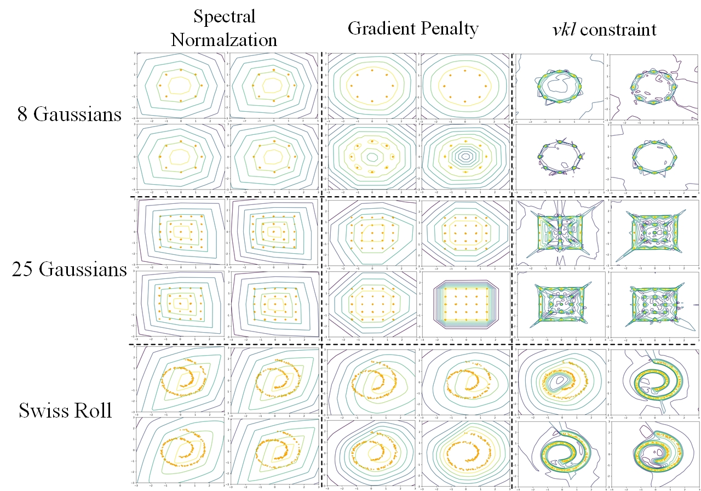
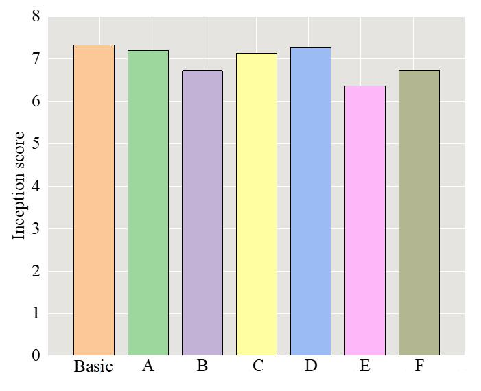
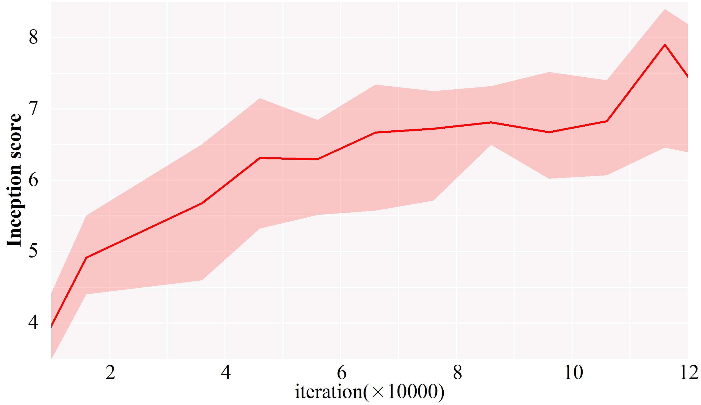
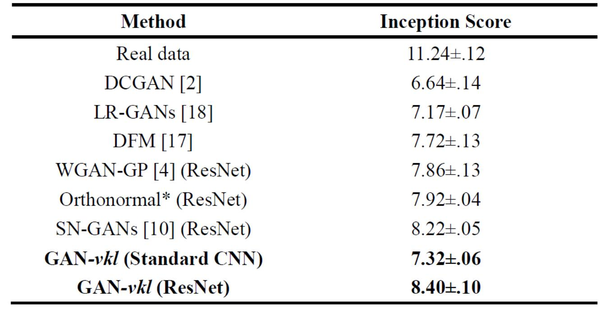
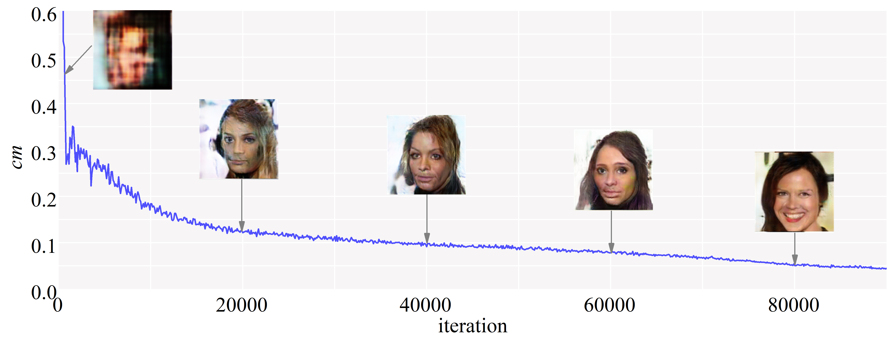

# GAN_vkl
implementation of GAN-vkl

You'd better to train serveal times with multiple seeds of weight initialization to get the best results

## Prerequisites

- Python 3.3+
- Tensorflow
- SciPy
- pillow
- (Optional) Large-scale CelebFaces Dataset and ImageNet

## Usage
Please download corresponding dataset in advance.
we assume CIFAR dataset is located in ./cifar, CELEBA and Imagenet are located in ./data/celebA and ./data/imagenet

First, download the inception model

    $ python download.py --outfile inception_score.model
    
the hyperparameter is in options.py. 
you could  choose the architeture you would like to train in Networks.py

To train a model with downloaded dataset:

    $ python main.py
    
if you want to train the toy model:

    $python gan_toy.py
    
 ## Results
 
 results on toy model:
 comparison of vkl constraint, gradient penalty and spectral normalization
 

inception scores under different seettings；
 
 
 variation of inception score with iteration on ResNet Based CNN
 
 
 comparison of state-of-the-arts GAN models
  
  
  Vartiation of cm with iteration:
  
 
 
    

  

